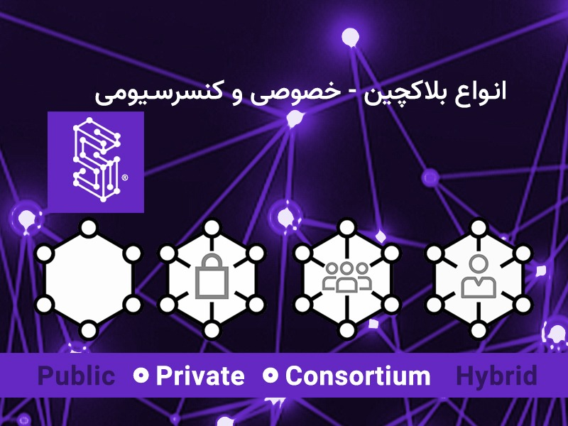

# معرفی انواع بلاکچین‌ها: خصوصی و کنسرسیومی

در مقاله پیشین (مقاله شماره 4) در مورد بلاک‌چین عمومی و مزایای و مشکلات آن مطالبی بیان شد و در این مقاله، در راستای معرفی سایر انواع بلاکچین، دو نوع بلاکچین خصوصی و کنسرسیومی نیز مورد بررسی قرار خواهد گرفت.

## بلاک‌چین خصوصی

بلاک‌چین خصوصی در واقع بلاک‌چینی است که در محیطی محدود مانند یک شبکه خصوصی کار می‌کند. در واقع بلاک‌چین خصوصی یک بلاک‌چین نیازمند به مجوز یا مجوز محور است که توسط یک نهاد مشخص و نه عموم مردم کنترل و مدیریت می‌شود.

برای ایجاد یک شبکه بلاک‌چینی در محیط یک شرکت یا سازمان با هدف استفاده از بلاک‌چین به منظور توسعه راهکارهای درون‌سازمانی، بلاک‌چین خصوصی یکی از بهترین عملکردها را دارد. به این صورت، سازمان می‌تواند هم‌زمان با استفاده از مزایای فناوری بلاک‌چین، به منظور حفظ حریم خصوصی، تعیین کند چه کسانی به اطلاعات و داده‌ها دسترسی داشته یا نداشته باشند. همچنین سازمان می‌تواند برای شبکه بلاک‌چین تحت مدیریت خود، پارامترهایی خاصی در سطح دسترسی و مجوز و مانند آن تعیین نماید.

شاید این سؤال به ذهن برسد که تفاوت اصلی بلاک‌چین عمومی و خصوصی دقیقاً در چیست؟ پاسخ در شیوه متفاوت دسترسی به شبکه در نوع عمومی و خصوصی آن است. به‌عبارتی‌دیگر، اگر دسترسی به شبکه بلاک‌چینی برای عموم آزاد باشد، بلاک‌چین در دسته عمومی قرار می‌گیرد؛ اما اگر ورود به شبکه برای عموم آزاد نباشد و محدود به افراد و اعضای خاصی باشد، شبکه از نوع خصوصی است. لازم به ذکر است، در هر دو نوع بلاک‌چین عمومی و خصوصی، اعضای شبکه از خصوصیاتی همانند شفافیت، اعتماد و امنیت بهره‌مند می‌شوند.

یکی دیگر از تفاوت‌های اصلی بلاک‌چین عمومی و خصوصی در مسئله تمرکزگرایی است. در شبکه بلاک‌چین خصوصی، بر خلاف شبکه بلاک‌چین عمومی، کنترل شبکه در انحصار یک نهاد مشخص و معین است و در نتیجه شبکه بلاک‌چین خصوصی، ذات غیرمتمرکز ندارد.

در بسیاری از موارد، به بلاک‌چین خصوصی، بلاک‌چین نیازمند به مجوز یا مجوز محور نیز گفته می‌شود؛ اما مفهوم بلاک‌چین مجوز محور بسیار وسیع‌تر است و برخی بلاک‌چین‌های عمومی نیز دربر می‌گیرد.

بلاک‌چین‌های Multichain، Hyperledger Fabric، Hyperledger Sawtooth و Corda از انواع بلاک‌چین‌های خصوصی هستند.

### نقاط قوت بلاک‌چین خصوصی در چیست؟

بلاک‌چین‌های خصوصی سریع هستند و این سرعت به دلیل کم بودن اعضا در شبکه‌های بلاک‌چین خصوصی نسبت به بلاک‌چین عمومی و نیز وجود سطح بالاتری از اعتماد در میان اعضای شبکه نسبت به بلاک‌چین‌های عمومی است. دو مورد بیان شده باعث می‌شود، برای رسیدن به اجماع و تأیید و ثبت نهایی تراکنش، زمان کمتری صرف شود.

بلاک‌چین‌های خصوصی، مقیاس‌پذیرتر نیز هستند. چرا که در بلاک‌چین‌های خصوصی، تنها تعداد کمی از اعضای شبکه مجوز بررسی و تأیید تراکنش‌ها را دارا هستند. به‌این‌ترتیب، با رشد شبکه و افزایش تراکنش‌ها، بلاک‌چین خصوصی می‌تواند با همان سرعت و کارایی قبلی به کار خود ادامه دهد و همه این مزایا به‌واسطه ذات تصمیم‌گیری متمرکز در شبکه‌های بلاک‌چین خصوصی است.

### نقاط ضعف بلاک‌چین خصوصی در چیست؟

بلاک‌چین‌های خصوصی، در واقع به‌هیچ‌وجه از ذات غیرمتمرکز بودن بهره‌مند نیستند. این امر بزرگ‌ترین نقطه‌ضعف بلاک‌چین خصوصی است و با ذات و روح و فلسفه فناوری دفتر کل توزیع شده در تضاد است. دستیابی به اعتماد در شبکه بلاک‌چین خصوصی به‌واسطه آن ایجاد می‌شود که تصمیم نهایی در این نوع شبکه‌ها توسط گره‌های متمرکز گرفته می‌شود.

در نهایت، ازآنجایی‌که در شبکه بلاک‌چین خصوصی، اعضتکای کمی نسبت به بلاکچین عمومی وجود دارند، امنیت به‌خوبی بلاک‌چین‌های عمومی تضمین نمی‌شود. بایستی به این نکته توجه داشت که هرچه از فضای بلاک‌چین عمومی فاصله بگیریم و به نوع خصوصی آن نزدیک شویم، از امنیت فاصله گرفته و به‌سرعت نزدیک می‌شویم.

### کاربردهای بلاک‌چین خصوصی در چیست؟

در ادامه برخی از کاربردهای بلاک‌چین خصوصی آورده شده است:

**مدیریت زنجیره تأمین**: سازمان‌ها برای مدیریت زنجیره تأمین خود می‌توانند از بلاک‌چین خصوصی استفاده کنند.

**مالکیت دارایی**: به کمک بلاک‌چین خصوصی می‌توان نسبت به تعریف، تبادل و ره‌گیری دارایی‌های دیجیتالی اقدام کرد.

**رأی‌گیری داخلی**: بلاک‌چین سازمانی در برگزاری انتخابات درون‌سازمانی بسیار کارآمد است.

## بلاک‌چین کنسرسیومی

بلاک‌چین کنسرسیومی (که گاهی به‌عنوان بلاک‌چین فدراسیونی نیز نامیده می‌شود) راهکاری هوشمندانه برای سازمان‌هایی است که مایل‌اند به‌صورت هم‌زمان از مزایای بلاک‌چین عمومی و خصوصی بهره گیرند. در معماری مبتنی بر بلاک‌چین کنسرسیومی، برخی جنبه‌های سازمان به‌صورت عمومی در آمد و برخی به‌صورت خصوصی باقی می‌ماند.

فرایند اجماع در بلاک‌چین کنسرسیومی توسط گره‌ها و اعضای موجود کنترل و مدیریت می‌شود، به‌عبارتی‌دیگر با اینکه مشارکت در فرایند اجماع در بلاک‌چین‌های کنسرسیومی برای همگان ممکن نیست، اما تنها یک نهاد به‌صورت متمرکز مسئول مدیریت فرایند اجماع نبوده و به این شکل، بلاک‌چین کنسرسیومی تا حدودی از روحیه و ذات غیرمتمرکز بودن بهره‌مند است.

برای تضمین صحت عملکرد، بلاک‌چین کنسرسیومی گره‌هایی با عنوان ولیدیتور یا احراز کننده دارد که دو عملکرد را انجام می‌دهند، تأیید تراکنش‌ها و همچنین مقداردهی اولیه به تراکنش‌ها و ارسال آن‌ها. در این شبکه نوع دیگری از گره نیز وجود دارد که تنها می‌تواند تراکنشی را آغاز و دریافت کند و امکان مشارکت در فرایند اجماع را ندارد (گره‌های عضو).

به‌صورت خلاصه، بلاک‌چین کنسرسیومی تمامی ویژگی‌های بلاک‌چین خصوصی من‌جمله شفافیت، حریم خصوصی و کارآمدی را ارائه می‌دهد اما به نحوی غیرمتمرکز.

بلاک‌چین‌های Macro Polo،  Energy Web Foundationو IBM Food Trust از انواع بلاک‌چین‌های کنسرسیومی هستند.

### نقاط قوت بلاک‌چین کنسرسیومی در چیست؟

نقاط قوت و مزایای بلاک‌چین کنسرسیومی به شرح زیر است:

- این بلاک‌چین در مدیریت منابع، کنترل و قدرت سفارشی‌سازی بیشتری ارائه می‌دهد.
-	بلاک‌چین‌های کنسرسیومی مقیاس‌پذیری بهتر و امنیت بیشتری به همراه دارند.
-	نسبت به شبکه‌های بلاک‌چین عمومی، کارایی بیشتری دارد.
-	با ساختارهای حاکمیتی چارچوب‌مندی کار می‌کنند. به‌عبارتی‌دیگر می‌توان حاکمیت شبکه را به‌صورت دقیق تعیین نمود.
-	در این شبکه کنترل دسترسی‌ها ممکن است.

### نقاط ضعف بلاک‌چین کنسرسیومی در چیست؟

نقاط ضعف و عیوب بلاک‌چین کنسرسیومی به شرح زیر است:

-	با اینکه بلاک‌چین کنسرسیومی امنیت دارد، اما در صورت همکاری و همدستی اعضای شبکه (که تعداد زیادی نیستند)، کل شبکه می‌تواند در معرض خطر قرار گیرد.
-	بلاک‌چین کنسرسیومی نسبت به بلاک‌چین عمومی از شفافیت کمتری برخوردار است.
-	مقررات‌گذاران و تصمیم‌سازان می‌توانند تأثیر بسیار زیادی در عملکرد شبکه داشته باشند.
-	بلاک‌چین کنسرسیومی نسبت به سایر انواع بلاک‌چین‌ها از گمنامی کمتری برخوردار است.

### کاربردهای بلاک‌چین کنسرسیومی در چیست؟

در ادامه برخی کاربردهای بلاک‌چین کنسرسیومی آورده شده است:

بانکداری و پرداخت: گروهی از بانک‌ها می‌توانند در تعامل با یکدیگر، یک کنسرسیوم تشکیل دهند و گره‌هایی که مسئولیت تأیید تراکنش‌ها را دارد نیز مشخص کنند.

**تحقیق**: می‌توان از بلاک‌چین کنسرسیومی برای به‌اشتراک‌گذاری نتایج و داده‌های تحقیقات علمی و آکادمیک استفاده کرد.

**رهگیری مواد غذایی**: بلاک‌چین کنسرسیومی ابزاری بسیار کارآمدی برای رهگیری موارد و کالاهای غذایی و خوراکی است.

در مقاله بعدی، به معرفی بلاک‌چین ترکیبی خواهیم پرداخت.

