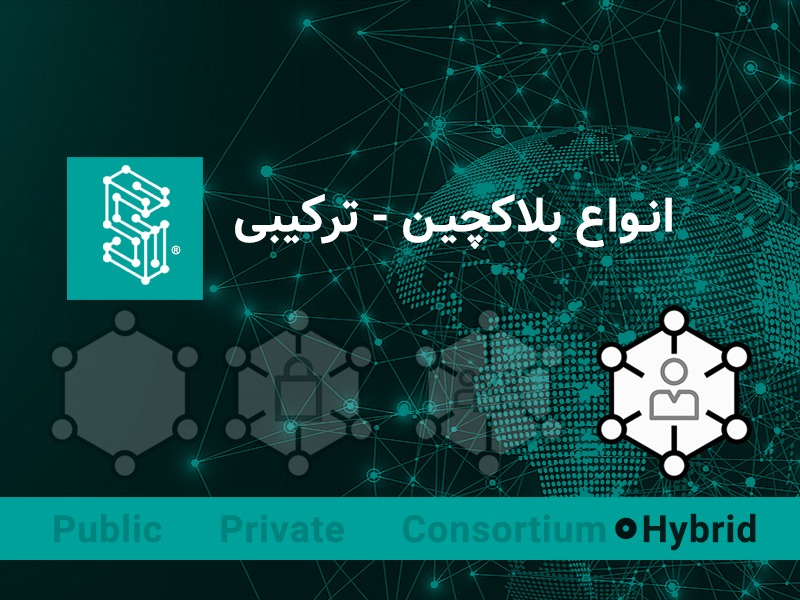

  
# معرفی انواع بلاکچین‌ها: ترکیبی

در مجموعه مقالات بررسی انواع بلاک‌چین‌ها، سه نوع بلاک‌چین عمومی، خصوصی و کنسرسیومی مورد بررسی دقیق قرار گرفت و برای هر مورد، نقاط ضعف و قدرت و کاربردهای آن‌ها ذکر شد. در آخرین مقاله از این سلسله مقالات، نوع آخر و چهارم بلاک‌چین با عنوان بلاک‌چین ترکیبی تجزیه و تحلیل خواهد شد.

## بلاک‌چین ترکیبی

بلاک‌چین ترکیبی یا Hybrid Blockchain یکی دیگر از انواع بلاک‌چین است. این نوع بلاک‌چین آخرین نوع بلاک‌چینی است که در این سلسله مقالات به آن پرداخته‌ایم. در ابتدای بایستی بیان شود که بلاک‌چین ترکیبی ممکن است مشابه بلاک‌چین کنسرسیومی به نظر برسد اما اینچنین نیست.

بهترین تعریف برای بلاک‌چین ترکیبی، ترکیب بلاک‌چین عمومی و خصوصی است. این نوع از بلاک‌چین در سازمان‌هایی کاربرد دارد که نه تمایل به استفاده از بلاک‌چین خصوصی دارند و نه بلاک‌چین عمومی، و قصد دارند از این فناوری جذاب نیز استفاده کنند.

در بلاک‌چین کنسرسیومی، یک گروه، مدیرت زنجیره‌بلوک را برعهده دارند. این گروه در مورد نحوه عملکرد بلاک‌چین تصمیم‌گیری می‌کنند. همچنین در بلاک‌چین کنسرسیومی، دسترسی‌ها محدود است و مدیران تصمیم می‌گیرند چه افرادی به داده‌ها دسترسی داشته باشند. اما بلاک‌چین ترکیبی، تلفیقی از بلاک‌چین عمومی و خصوصی است. بلاک‌چین ترکیبی را می‌توان این گونه تعریف کرد که یک بلاک‌چین عمومی است که بر روی یک بلاک‌چین خصوصی میزبانی می‌شود.

به صورت فنی، در بلاک‌چین ترکیبی، از یک زنجیره بلوک خصوصی برای تولید داده‌های هش شده، استفاده می‌شود و نتایج رمزنگاری شده بدون نگرانی از نقض حریم خصوصی داده‌ها، بر روی بلاک‌چین عمومی ذخیره می‌شود.

  | بلاک‌چین ترکیبی	| بلاک‌چین کنسرسیومی
--- | :---: | ---
دسترسی | برخی بخش‌ها عمومی هستند و برخی داده‌های خصوصی نگهداری می‌شوند | تنها اعضای منتخب قدرت دسترسی کامل به داده‌ها را دارند
سرعت تراکنش | سریع | سریع
حریم خصوصی | تا حدودی | تا حدودی
میزان تمرکز و توزیع‌شدگی | تا حدودی غیر متمرکز | غیرمتمرکز

بلاک‌چین‌های Dragonchain و XinFin’s Hybrid Blockchain از نوع بلاک‌چین‌های ترکیبی هستند.

## نقاط قوت بلاک‌چین ترکیبی در چیست؟

در ادامه فهرست نقاط قوت بلاک‌چین ترکیبی ذکر شده است:

- در اکوسیستمی بسته و بدون نیاز به عمومی‌سازی همه داده‌های فعالیت می‌کند.
- بر اساس نیازها، می‌توان قواعد و قوانین بلاک‌چین را تغییر داد.
- بلاک‌چین ترکیبی در برابر حملات ۵۱% مصون است.
- با اینکه به یک بلاک‌چین عمومی متصل است؛ اما همچنان حریم خصوصی داده را به همراه دارد.
- در مقایسه با بلاک‌چین عمومی، از مقیاس‌پذیری بهتری برخوردار است.

## نقاط ضعف و عیوب بلاک‌چین ترکیبی در چیست؟

در ادامه فهرست نقاط ضعف و عیوب بلاک‌چین ترکیبی ذکر شده است:

- به صورت کامل شفاف نیست.
- ارتقاء و به روزرسانی بلاک‌چین‌های ترکیبی می‌تواند چالش برانگیز باشد.
- برای مشارکت اعضای شبکه هیچ مکانیزم انگیزشی تعریف نشده است.

## موارد کاربرد بلاک‌چین ترکیبی

برخی از بهترین کاربردهای بلاک‌چین ترکیبی به شرح زیر است:

**املاک و مستغلات**: از بلاک‌چین ترکیبی می‌توان در حوزه املاک استفاده کرد به این صورت که شرکت‌های سازنده از سامانه‌ها و اطلاعات خود را بر روی بلاک‌چین خصوصی نگهداری کنند و از بخش عمومی برای ارائه اطلاعات به مردم استفاده کنند.

**اینترنت اشیاء**: استفاده از یک بلاک‌چین کاملاً عمومی برای توسعه اینترنت اشیاء، مخاطراتی را به همراه دارد. برای نمونه هکرها می‌توانند از موقعیت و داده‌های تبادل شده در میان تجهیزات اینترنت اشیاء مطلع شده و از این اطلاعات سوء استفاده کنند. به کمک بلاک‌چین ترکیبی، داده‌ها و اطلاعات مهم بر روی بلاک‌چین خصوصی نگهداری می‌شود و برخی داده‌ها که جنبه عمومی دارد بر روی بلاک‌چین عمومی قرار می‌گیرد.

**تبادلات مالی جهانی**: حتی در صنعت مالی نیز می‌توان از بلاک‌چین ترکیبی استفاده کرد. برای نمونه XinFin از یک بلاک‌چین ترکیبی که در آن اتریوم بخش عمومی و کوآروم بخش خصوصی را می‌سازد، استفاده می‌کند. بدین ترتیب داده‌های حساس مالی بر روی کوآروم نگهداری می‌شود و اطلاعات عمومی بر روی اتریوم قرار می‌گیرد.

## کدام نوع بلاک‌چین به درد کسب‌وکار ما می‌خورد؟

هر یک از انواع بلاک‌چین‌ها، خصوصیاتی ویژه‌ای برای ارائه دارند و به همین دلیل پاسخ یکسانی به این پرسش که چه بلاک‌چینی به درد کسب‌وکار ما می‌خورد وجود ندارد.

برای پاسخ به این پرسش در ادامه با ما همراه باشید.

### شبکه بلاک‌چین عمومی

همانطور که می‌دانید، همه افراد می‌توانند به بلاک‌چین‌های عمومی متصل شوند و اطلاعات موجود در دفتر کل نیز برای همه قابل خوانش است. در نتیجه بلاک‌چین عمومی برای سازمان‌هایی که در پی ایجاد اعتماد و شفافیت هستند بسیار مناسب است. به عبارتی دیگر، نهادهایی همانند سمن‌ها (سازمان‌های مردم نهاد NGO) یا گروه‌های حمایت از جامعه می‌توانند از این زیرساخت برای ایجاد اعتماد در میان مردم و شفافیت مالی خود استفاده کنند.

ذات عمومی این نوع از بلاک‌چین خود بیان کننده آن است که برای بسیاری از کسب‌وکارهای بخش خصوصی که مایلند داده‌های خود را به صورت خصوصی و دور از دست رقبا نگهدارند، کاربردی ندارد. از سویی دیگر، استفاده از برخی از زنجیره‌بلوک‌های امن که از الگوریتم اجماع PoW استفاده می‌کنند هزینه‌های سربار بالایی به کسب‌وکار وارد می‌کند (همانند کارمزد بالا در شبکه اتریوم).

بنابراین، اگر شما فردی هستید که در حال توسعه یک رمزارز جهان‌روایید، احتمالاً بلاک‌چین عمومی به کار شما خواهد آمد.

### شبکه بلاک‌چین خصوصی

شبکه بلاک‌چین خصوصی، در نقطه مقابل بلاک‌چین عمومی قرار دارد. این نوع از بلاک‌چین برای کسب‌وکارهایی مناسب است که علاقه‌مندند از یک شبکه خصوصی استفاده کنند؛ اما از مزایای فناوری بلاک‌چین نیز محروم نشوند. بلاک‌چین خصوصی تمامی ویژگی‌های بلاک‌چین را ارائه داده و به همه اعضای شرکت روشی برای ایجاد اعتماد از طریق تغییرناپذیری و امنیت اطلاعات معرفی می‌کند.

همچنین در بلاک‌چین خصوصی، شرکت می‌تواند بنابر شرایط، قوانین حاکم بر شبکه بلاک‌چینی را تنظیم و مدیریت کند.

### شبکه بلاک‌چین کنسرسیومی

نوع بعدی بلاک‌چین، بلاک‌چین کنسرسیومی است که در آن شبکه به جای یک گره، توسط مجموعه‌ای از سازمان‌ها کنترل می‌شود. این نوع از بلاک‌چین هر زمانی که صحبت از یک همکاری فراسازمانی و فراملی باشد مناسب است، همانند زنجیره تامین مواد غذایی و دارویی.

### شبکه بلاک‌چین ترکیبی

در نهایت به آخرین نوع بلاک‌چین می‌رسیم. چنانچه مایل هستید از تمامی مزایای بلاک‌چین خصوصی و عمومی به صورت همزمان استفاده کنید و از کمترین عیوب آن‌ها آسیب ببینید، بدون شک بلاک‌چین ترکیبی مناسب شما است. به نظر می‌رسد برای بسیاری از کسب‌وکارهایی که در آینده به سمت فناوری بلاک‌چین خواهند آمد، نوع ترکیبی آن بیشتر کاربرد داشته باشد.

## جمع بندی

به انتهای سلسله مقالات بررسی انواع بلاک‌چین‌ها رسیدیم. به صورت کلی، اگر شرکتی هستید و می‌خواهید از فناوری بلاک‌چین استفاده کنید؛ اما تمایل دارید برای مسائل حریم خصوصی و امنیت داده همه چیز را عمومی نکنید از بلاک‌چین خصوصی استفاده کنید. اگر می‌خواهید مقادیری شفافیت به سامانه خود اضافه کنید، از بلاک‌چین عمومی استفاده کنید اما بدانید بلاک‌چین‌های عمومی به دلیل شکل الگوریتم‌های اجماعشان، نسبتا کند و مقیاس‌پذیر نیستند و به همین دلیل مناسب کاربردهای سازمانی نیستند.

