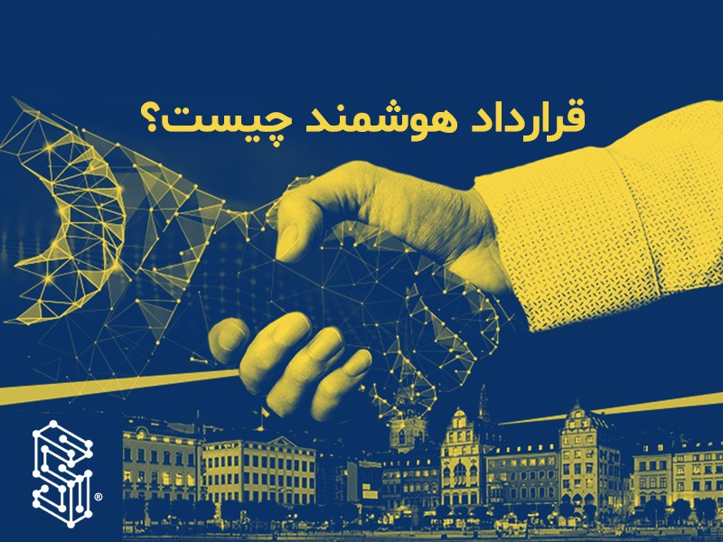

  
# قرارداد هوشمند چیست؟

## قرارداد هوشمند چیست؟

به زبان ساده، قراردادهای هوشمند، برنامه‌های کامپیوتری هستند که بر روی زنجیره‌بلوک ذخیره شده‌اند و در صورت وقوع شرایط از پیش تعیین شده، اجرا می‌شوند. از قراردادهای هوشمند برای خودکارسازی اجرای یک موافقت‌نامه یا قرارداد استفاده می‌شود و بدین ترتیب طرفین قرارداد مطمئن می‌شوند که بدون دخالت یک نهاد واسط و بدون هدر رفت زمان، نتایج و خروجی‌های مورد نظر حاصل خواهد شد. همچنین قراردادهای هوشمند می‌توانند یک جریان کاری را خودکار کنند و در صورت بروز شرایطی خاص و از پیش تعیین شده، فعالیت‌ها و گام‌های بعدی را آغاز نمایند.

## قرارداد هوشمند چگونه کار می‌کند؟

قراردادهای هوشمند با یک گزاره ساده "اگر/زمانی که ......آنگاه ....." که در قالب کد بر روی بلاکچین قرار گرفته است کار می‌کنند و زمانی که شرایطی از پیش تعیین شده ("اگر/زمانی که")، به وقوع بپیوندد و تایید شود، شبکه‌ای از کامپیوترها مجموعه امور مندرج در بخش "آنگاه" را اجرایی می‌کنند. این مجموعه امور می‌تواند شامل انتقال سرمایه به یک شخص خاص، ثبت اطلاعات یک خودرو، ارسال هشدار و اعلان یا صدور یک بلیت باشد و پس از تکمیل آن تراکنش، زنجیره‌بلوک مجددا خود را به روزرسانی می‌کند. این بدان معناست که بعد ثبت نهایی تراکنش، دیگر امکان تغییر آن وجود ندارد و تنها افراد دارای مجوز می‌توانند نتایج به دست امده را مشاهده و بررسی کنند.

درون یک قرارداد هوشمند، می‌توان به تعداد کافی شرایط و مقررات تعیین کرد تا تمامی طرفین قرارداد مطمئن شوند که تمامی کارها و امور و توافقات به صورت کاملاً دقیق انجام شود. برای تعیین شرایط و مقررات قرارداد هوشمند، طرفین قرارداد بایستی بر سر نحوه اجرای تراکنش‌ها و انتقال داده‌ها بر روی بلاکچین به توافق برسند و قواعد "اگر/زمانی که ......آنگاه ....." را که بر تراکنش‌ها کنترل ایجاد می‌کنند را تعیین کنند. همچنین بایستی تمامی استثنائات ممکن را برشمرند و چارچوبی برای حل‌وفصل مشکلات مشخص کنند.

پس از این گام، یک برنامه نویس می‌تواند قرارداد هوشمند را در قالب کد در بیاورد. البته لازم به ذکر است که بسیاری قالب آماده و ابزارهای کارآمد برای توسعه قراردادهای هوشمند در فضای اینترنت وجود دارد که این فرایند را سریع و ساده کرده است.

در واقع  می‌توان گفت قرارداد هوشمند یک کد برنامه نویسی شده است که بر روی یک شبکه غیر متمرکز مانند بلاک‌چین اجرا می‌شود و شرایط یک معامله خاص را تعریف می‌کند همچنین با دریافت ورودی‌های مشخص، وظایف محوله و یک سری دستورات را بدون نیاز به واسطه بین طرفین اجرا می‌کند.

منطق قرارداد هوشمند قابل‌تغییر نیست و به همین دلیل از آن‌ها به عنوان قرارداد یاد می‌شود و دقیقاً مانند توافق بین طرفین عمل می‌کنند. همچنین در حالت کلی زمانی که یک قرارداد هوشمند بر روی بلاک‌چین اجرا می‌شود دیگر امکان توقف و یا تغییر در آن وجود ندارد و حتی شخصی که کد آن را برنامه نویسی کرده هم نمی‌تواند آن را تغییر دهد.

به زبان ساده می‌توان گفت قرارداد هوشمند یک پروتکل میان دو یا چند نفر است. در این قرارداد بر اساس توافقات از پیش تعیین شده می‌بایست سر موعد مقرر، عملیاتی به صورت خودکار انجام شود. این قراردادها معمولاً این‌گونه طراحی می‌شود که در صورت تحقق تعهدات یکی از طرفین به‌صورت خودکار تعهد طرف دیگر را انجام می‌دهد. در یک مثال کاربردی و ساده، در قرارداد هوشمند، می‌توان تعیین کرد که اگر به مقدار دلخواه به حسابی (در شبکه زنجیره‌بلوک) رمزارزی واریز شود، رمزارزی دیگر که می‌تواند سهام یک شرکت، توکنی با پشتوانه یک دارائی یا هر چیز دیگر باشد، به‌صورت خودکار و بدون دخالت منتشرکننده، به آدرسی مشخص ارسال شود (قرارداد هوشمند ICO).

## مزایای قراردادهای هوشمند

### سرعت، کارایی و دقت

زمانی که یک شرط برقرار شد، قرارداد هوشمند بلافاصله اجرا می‌شود. از آنجایی که قراردادهای هوشمند دیجیتالی و خودکار هستند، هیچ کار کاغذی و بروکراتیکی در میان نیست و به همین دلیل دیگر خبری از خطاهای انسانی و اشتباهات دستی در پرکردن و تکمیل اطلاعات و فرم‌ها در میان نیست.

### اعتماد و شفافیت

از آنجایی که در محیط قراردادهای هوشمند نیازی به دخالت نهادهای واسط نیست و از آنجایی که سابقه تراکنش‌ها به صورت رمزنگاری شده در اختیار تمامی ذی‌نفعان قرارداد قرار دارد، هیچ نگرانی در مورد دستکاری در اطلاعات بنابر انگیزه‌های شخصی وجود ندارد.

### امنیت

کل سابقه تراکنش‌های بلاکچینی رمزگذاری می‌شوند که این امر باعث می‌شود این اطلاعات در برابر هک شدن به شدت مقاوم شوند. همچنین از آنجایی که هر مجموعه از داده‌ها (بلوک) به بلوک‌های قبلی متصل شده اند و تمامی داده‌ها بر روی یک دفترکل توزیع شده در میان تمامی ذی‌نفعان قرار دارد، هکرها برای تغییر یک داده، بایستی زنجیره‌ای بلند از اطلاعات را تغییر دهد که این امر بسیار هزینه بر است.

### صرفه‌جویی در منابع

قراردادهای هوشمند نیاز به واسطه‌ها برای مدیریت تراکنش‌ها را حذف کرده و بدین ترتیب در زمان و کارمزددها کاهش ایجاد خواهد شد.

## کاربردهای قرارداد هوشمند

از قراردادهای هوشمند می‌توان در تمامی صنایع برای خودکارسازی روال‌های کاری و قراردادهای تجاری استفاده کرد. در ادامه چهار حوزه کلی استفاده از قراردادهای هوشمند فهرست شده است.

### تغییر شکل حل‌وفصل اختلافات

حل اختلاف در فضای مالی بسیار زمانبر و پرهزینه است و ممکن است این روال‌ها ماه‌ها به طول انجامد. قراردادهای هوشمند به واسطه کد کردن تفاهم‌ها و قواعد تجاری، فرایندهایی نظیر شناسایی اختلافات، تطبیق اسناد، انجام تراکنش‌ها و حل‌وفصل اختلافات را به صورت خودکار مدیریت خواهد کرد.

### ایجاد یک زنجیره تامین مقاوم و با ثبات

راهکارهای مدیریت زنجیره تامین توسعه داده شده توسط IBM، از قراردادهای هوشمند برای ساده‌سازی جریان اطلاعاتی مربوط به کالا همانند ارسال کالا، تحویل کالا و داده‌های اینترنت اشیاء که وقوع شرایط را به صورت مستمر از طریق حسگرهای خود بررسی می‌کنند، استفاده کرده است.

### ایجاد اعتماد در تبادلات مالی

قراردادهای هوشمند یکی از اجزای حیاتی در شبکه‌های تامین مالی است. قواعد استاندارد شده و تفاهمات تجاری از طریق کد به قراردادهای هوشمند تبدیل می‌شوند و بدین ترتیب ضمن کاهش ریسک‌های تجاری، مدل‌های جدید درآمدی نیز ارائه می‌دهد.

### بازآفرینی ضمانت‌نامه‌های بانکی

یک کنسرسیوم بانکی با استفاده از بلاکچین و قراردادهای هوشمند، ضمانت‌نامه‌های بانکی و فرایند انتشار آن را دیجیتالی و متحول کرده است. این پلتفرم جدید که با نام Lygon .معرفی شده است، متقاضیان، صادرکنندگان و ذینفعان را قادر می‌سازد تا ضمانت‌های الزام‌آور قانونی را تنها در یک روز دریافت کنند

