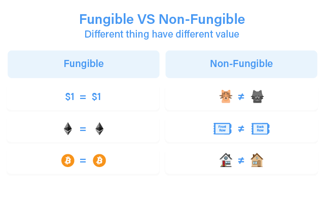

  
# استانداردهای توکن‌سازی در شبکه‌های بلاک‌چینی / قسمت اول

بلاک‌چین ایرانی سور، بستری برای توسعه قراردادهای هوشمند و ایجاد توکن است. به همین منظور در این رشته مقالات به بررسی انواع استانداردهای توکن‌سازی در بلاک‌چین‌های معروف و استانداردهای توکن‌سازی در شبکه سور پرداختیم. با ما همراه باشید.

پیش از ورود به بحث استانداردهای توکن‌سازی، نیاز است ابتدا استاندارد قراردادهای هوشمند تشریح و تفهیم شود. استانداردهای قراردادهای هوشمند، شرایط و قواعد را تعریف می‌کند که چنانچه قرارداد هوشمند تحت آن توسعه یابد، می‌تواند بر بستر آن شبکه بلاک‌چینی اجرا شده و مورد بهره‌برداری قرار گیرد. استانداردهای قراردادهای هوشمند شامل استانداردهای توکن، دفاتر ثبت‌نام[^1]، ساختار کتابخانه/پکیج[^1] و مانند آن است.

پس از تعریف استانداردها، قراردادهای هوشمند بایستی از یکسری الزامات برای ایجاد قابلیت‌ها و کارکردهای پایه همانند خلق توکن، انجام تراکنش، ارسال و دریافت اطلاعات و ازاین‌دست موارد پیروی و تبعیت کنند. ازآنجایی‌که استانداردهای قراردادهای هوشمند قواعد استفاده از شبکه بلاک‌چین را تعریف می‌کنند، بسیار مهم و کلیدی هستند و یک استاندارد خوب، می‌تواند ارتباطات میان قراردادهای هوشمند در یک شبکه بلاک‌چینی را کارآمد کند.

استاندارد توکن زیرمجموعه استاندارد قرارداد هوشمند است. برای بلاک‌چین‌هایی که از قراردادهای هوشمند پشتیبانی می‌کنند، استانداردهای توکن در واقع برای مردم روال خلق، انتشار و توسعه توکن‌های مبتنی بر یک شبکه بلاک‌چینی خاص را تشریح می‌کنند.

در ادامه، رایج‌ترین استاندارد توکن‌سازی بر بستر شبکه اتریوم بیان شده است.

## استانداردهای رایج شبکه اتریوم

استاندارد ERC یا همان درخواست برای نظردهی در شبکه اتریوم، شرایط و ضوابط و مستندات فنی لازم برای توسعه توکن بر شبکه اتریوم را توصیف می‌کند. استاندارد ERC شامل قواعدی که توکن‌های مبتنی بر شبکه اتریوم بایستی از آن تبعیت کنند. استانداردهای رایج ERC مجموعه‌ای از توابع لازم برای یک نوع از توکن تعریف می‌کند تا بدین ترتیب، برنامه‌های کاربردی و قراردادهای هوشمند بتوانند با توکن‌ها به روشی استاندارد ارتباط گیرند. در ادامه تعدادی از استانداردهای رایج و مهم ERC فهرست شده است.

نام استاندارد | تاریخ ایجاد استاندارد | موارد کاربرد
--- | :---: | ---
ERC-20 | ۱۹/۱۱/۲۰۱۵ | ERC-20 استاندارد توکن‌سازی برای توکن‌ها مثلی که توابع اصلی و بنیادین برای ایجاد قابلیت ارسال توکن و همچنین شرایط تأیید شدن توکن توسط اعتبارسنج (Validator)های شبکه اتریوم را تعریف می‌کند.
ERC-721 | ۲۴/۰۱/۲۰۱۸ | استاندارد توکن‌های غیر مثلی (NFT)
ERC-777 | ۲۰/۱۱/۲۰۱۷ | شامل تمام توابع موردنیاز برای ارسال یک توکن به نیابت از یک آدرس، حساب یا قرارداد دیگر است.
ERC-1155 | ۱۷/۰۶/۲۰۱۸ | یک استاندارد برای قراردادهایی است که چندین نوع توکن را مدیریت می‌کند.

### بررسی استاندارد توکن ERC-20

استاندارد ERC20 یک استاندارد روی بلاک‌چین اتریوم است تا پروژه‌های گوناگون بتوانند بدون توسعه یک بلاک‌چین اختصاصی، توکن موردنظر خود را روی بلاک‌چین اتریوم توسعه دهند. در واقع ERC20 را نمی‌توان یک نرم‌افزار در نظر گرفت، به دلیل اینکه این استاندارد مجموعه‌ای از قوانین و چارچوب‌ها برای توسعه یک ارز دیجیتال است.

این استاندارد نخستین‌بار در سال ۲۰۱۵ توسط یکی از برنامه‌نویسان بلاک‌چین اتریوم به نام Fabib Vogelstellar به دنیای این فنّاوری معرفی شد. بسیاری از برنامه‌های مبتنی بر بلاک‌چین که امروزه آن‌ها را با نام برنامه‌های غیرمتمرکز DAPPs می‌شناسیم ازجمله، کیف پول‌ها، صرافی‌های غیرمتمرکز، بازی‌ها و غیره با توکن‌های توسعه‌یافته روی استاندارد ERC20 سازگاری دارند و به همین خاطر کاربران و توسعه‌دهندگان در استفاده از این توکن‌ها سهولت کاربردی بیشتری را تجربه می‌کنند.

استاندارد ERC-20، رایج‌ترین استاندارد برای توکن‌های مبتنی بر شبکه اتریوم است. ERC-20 یک استاندارد فنی برای انتشار توکن بر روی شبکه اتریوم است و در واقع این استاندارد فهرستی از قواعدی و شرایطی که تمام توکن‌های مبتنی بر بلاک‌چین اتریوم بایستی پیروی کنند را ارائه می‌دهد. استاندارد ERC-20 واسطی ساده است که اجازه ایجاد توکن بر بستر اتریوم را داده و باعث می‌شود این توکن‌ها بتوانند به‌راحتی در میان سایر برنامه‌های کاربردی نظیر DeFiها منتقل و باز استفاده شوند.

همچنین، ERC-20 استاندارد توکن‌های مثلی (Fungible) نیز هست. توکن‌های مثلی، توکن‌هایی هستند که هر واحد آن (یا بخشی از آن) شبیه یکدیگر هستند و تفاوت آن‌ها قابل تشخیص نیست. برای مثال یک دلار دست شما، با یک دلاری که در دست دیگران است یکسان است، دقیقاً بیت‌کوین هم به همین ترتیب یک رمزارز مثلی است.

استاندارد ERC-20 شش تابع اصلی دارد که برای تطابق با این استاندارد، این شش تابع بایستی پیاده‌سازی شود. این توابع بدین شرح هستند:

- تابع totalSupply(): برای گرفتن میزان منابع (total supply) یک توکن اتریومی خاص مورداستفاده قرار می‌گیرد.
- تابع balanceOf(): رهگیری موجودی توکن هریک از کیف‌پول‌های اتریومی را برعهده دارد.
- تابع transfer(): پس از ایجاد توکن، این تابع می‌تواند تمام توکن‌ها را به یک کیف منتقل کند یا میان سرمایه‌گذاران یک ICO توزیع کند.
- تابع approve(): برای «تأیید» سایر حساب‌ها برای برداشت مقدار معینی از توکن‌ها از حساب فراخوانی‌کننده تابع استفاده می‌شود.
- تابع Allowance(): بعد از استفاده از تابع approve() برای مشاهده مقدار توکن‌هایی که حساب تأیید شده مجاز به برداشت از حساب اصلی است استفاده می‌شود.

سه تابع اختیاری دیگری نیز در استاندارد ٍ ERC-20 وجود دارد، نام توکن، سمبل و نماد توکن و تعداد اعداد اعشار توکن (میزان خردشوندگی).

علاوه بر این، ERC-20 استاندارد توکن‌سازی انتخابی برای بسیاری از عرضه‌های اولیه سکه (ICO) بین سال‌های 2016-2018 بود که منجر به رونق انفجارگونه ICO شد و بسیاری از آلت‌کوین‌های امروزی به پشتوانه همین استاندارد توسعه داده شده است. نمونه‌هایی از توکن‌های ERC-20 عبارت‌اند از ChainLink (LINK)، Dai (DAI) و Basic Attention Token (BAT).

یکی از پروژه‌های معروف در فضای NFT، بازی کریپتوکیتی است. یک بازی که بر روی شبکه اتریوم در سال 2017 توسعه داده شد و امکان خرید، فروش یا جفت‌گیری گربه‌های دیجیتالی به نام “کیتی” را برای کاربران میسر می‌کرد. در حال حاضر، امکان خریدوفروش توکن‌های NFT در بازارهایی همانند OpenSea، Rarible، TokenTrove و همانند آن است.

استاندارد توکن ERC-721 حداقل رابطی را تعریف می‌کند که یک قرارداد هوشمند باید پیاده‌سازی کند تا امکان مدیریت، مالکیت و مبادله کلکسیون‌های کریپتو را فراهم کند.

بررسی استاندارد توکن ERC-777
استاندارد ERC-777، با هدف فائق آمدن بر محدودیت‌های استاندارد ERC-20 توسعه داده شده است. این استاندارد برای ارتباط‌گیری و تعامل با توکن، ویژگی‌های پیشرفته‌ای ارائه می‌دهد. برای نمونه، این استاندارد امکان ارسال توکن به نیابت از یک آدرس دیگر را می‌دهد و ویژگی‌های برای ارسال و دریافت توکن در اختیار دارنده توکن قرار می‌دهد که می‌تواند با استفاده از این امکانات، کنترل و تسلط بیشتر و بهتری بر دارایی خود داشته باشد. همچنین این استاندارد امکان ردکردن توکن‌هایی که از یک آدرس خاص (لیست سیاه) ارسال می‌شود را نیز ارائه می‌دهد.

تا اینجا، سه استاندارد توکن‌سازی در شبکه اتریوم بررسی شد. در مقاله بعدی، پس از بررسی استاندارد توکن‌سازی ERC-1155، سایر استانداردهای غیر اتریومی نیز بررسی خواهد شد.

[^1]: Name Registries

[^2]: Library/package Formats

