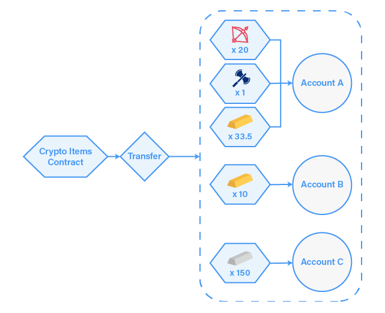

  
# استانداردهای توکن‌سازی در شبکه‌های بلاک‌چینی / قسمت دوم

در مقاله قبل، به موضوع استانداردسازی توکن و استانداردهای توکن‌سازی پرداخته شد. استانداردهای توکن‌سازی در شبکه اتریوم نیز بیان و تعدادی از آن‌ها نیز تشریح شد. در این مقاله ضمن بیان آخرین ورد از استاندارد توکن‌سازی در شبکه اتریوم، سایر استانداردهای در سایر شبکه‌های بلاک‌چینی بیان خواهد شد.

## استاندارد توکن‌سازی ERC-1155

استانداردهای توکن‌سازی همانند ERC-20 و ERC-721 برای استقرار هر نوع توکن نیاز به یک قرارداد هوشمند جداگانه دارد. این امر باعث تحمیل مقدار زیادی کدهای تکراری بر شبکه اتریوم می‌شود و از سویی دیگر، به‌واسطه جدایی هر یک از توکن‌ها در آدرس‌هایی مجزا و مجوزدار[^1]، برخی عملکردهای خاص محدود می‌شود. با ظهور و رشد بازی‌های بلاک‌چینی که توکن‌های NFT به‌عنوان آیتم‌های درون بازی بکار می‌روند، تعداد قراردادهای هوشمند به‌صورت انفجارگونه‌ای رشد کردند و منجر به مسائل و مشکلاتی در سطح کارایی و هزینه استفاده از بلاک‌چین‌های عمومی همچون اتریوم شدند.

استاندارد توکن‌سازی ERC-1155 برای قراردادهایی است که چندین نوع توکن را مدیریت می‌کنند. با استفاده از استاندارد ERC-1155 کاربر می‌تواند چندین نوع توکن (همانند ERC-20 و ERC-721) را به یکباره ارسال کرده و در هزینه‌های تراکنش صرفه‌جویی کند. به کمک این استاندارد، تبادل چندین توکن میسر شده و نیاز به تأیید مجزای هر یک از توکن‌ها از طریق قراردادهای هوشمند جداگانه از بین می‌رود. از طریق این استاندارد، تعریف و تلفیق توکن‌های مثلی و غیرمثلی تنها از طریق یک قرارداد هوشمند منفرد، امکان‌پذیر می‌شود.

## استانداردهای توکن‌سازی برای سایر بلاک‌چین‌ها

پروتکل‌های قراردادهای هوشمند در حال حاضر بسیار مورداستفاده قرار می‌گیرند. به‌غیراز شبکه اتریوم، پروژه‌ها و شبکه‌های بلاک‌چینی دیگری نیز وجود دارند که تمرکز آن‌ها بر قراردادهای هوشمند است. در ادامه این مقاله، بنیاد سور، تعدادی از پروژه‌های محبوب و استاندارد توکن‌سازی در این شبکه‌ها تشریح خواهد کرد.

### شبکه ایاس، EOS

پلتفرم بلاک‌چینی EOSIO، در ویژگی‌های هسته بلاک‌چینی با شبکه اتریوم بسیار متفاوت است بدین صورت که شیوه اجماع، میزان و مکانیزم کارمزد، ساخت حساب کاربری، اقتصاد توکن، رأی‌دهی، چند امضایی و سایر موارد این‌چنینی در درون قراردادهای هوشمند توسعه داده شده بر روی شبکه ایاس توسعه داده شده است.

قراردادهای سامانه ایاس برای پشتیبانی از عملکردهای پایه شبکه‌های بلاک‌چینی موارد eosio.bios، eosio.msig، eosio.token و eosio.wrap را در درون خود دارند. همانند اتریوم که استاندارد ERC-20 دارد، ایاس قرارداد هوشمند eosio.token دارد. قرارداد هوشمند Eosio.token ساختار و روش‌های لازم برای ایجاد، انتشار و مدیریت توکن‌های شبکه بلاک‌چینی EOSIO را بیان می‌کند.

علاوه بر این، برای انواع توکن‌ها همانند NFT، نیاز به یک چارچوب کاری طرف سومی وجود دارد. برای مثال، Simple Assets متعلق به CryptoLions و dGood متعلق به Mythical Games دو استاندارد توکن‌سازی برای NFT در شبکه ایاس هستند.

### شبکه نئو، NEO

شبکه نئو، پروژه دیگری است که با هدف ایجاد زیرساخت‌های لازم برای توسعه قراردادهای هوشمند به وجود آمده است. پیشنهادهای ایجاد بهبود در شبکه نئو که با نام NEP معرفی می‌شوند، استانداردهایی برای پلتفرم نئو شامل مشخصات پروتکل هسته، واسط‌های برنامه‌نویسی کاربری سمت کاربر و استانداردهای قراردادهای هوشمند را معرفی می‌کنند. NEP-5 یک استاندارد توکن‌سازی در شبکه بلاک‌چینی نئو را پیشنهاد می‌دهد که شامل مکانیزم ارتباط‌گیری کلی اجزای قراردادهای هوشمند در شبکه نئو هست. استاندارد NEP-10، استانداردی برای ایجاد توکن‌های NFT در شبکه نئو است اما این استاندارد کماکان درحال‌توسعه است.

### شبکه تزوس، Tezos

در شبکه تزوس، پیشنهادهای همکاری در جهت توسعه شبکه تزوس با نام TZIP معرفی می‌شوند. این پیشنهادها، مستنداتی هستند که شیوه ارتقاء و بهبود تزوس را از طریق پیاده‌سازی استانداردها و اجزای جدید همانند قراردادهای هوشمند بیان می‌کنند.

TZIP-7 عملیات انتقال توکن و تأیید تراکنش‌های ارسالی از سایر آدرس‌ها را پیاده‌سازی می‌کند. این استاندارد بسیار مشابه استاندارد ERC-20 شبکه اتریوم است. TZIP-12، به‌عنوان یک واسط برای چندین دارایی[^2] طراحی شده است که وابستگی توسعه‌دهندگان به استانداردهای خاص هر نوع از توکن را از بین می‌برد. استاندارد توکن‌سازی TZIP-12 با ارائه یک واسط قراردادی یکپارچه، از تمامی انواع توکن، چه مثلی و چه غیرمثلی پشتیبانی می‌کند.

## جمع‌بندی

در این دو مقاله، استانداردهای توکن‌سازی در شبکه‌های بلاک‌چینی بیان و تشریح شد، ازآنجایی‌که شبکه سور، بستری برای توسعه قراردادهای هوشمند است، لذا این شبکه نیز دارای استانداردهای توکن‌سازی خاص خود است که در مقالات بعدی در مورد آن‌ها توضیحات مفصلی بیان خواهد شد.

[^1]: Permissioned

[^2]: Multi-Asset Interface

