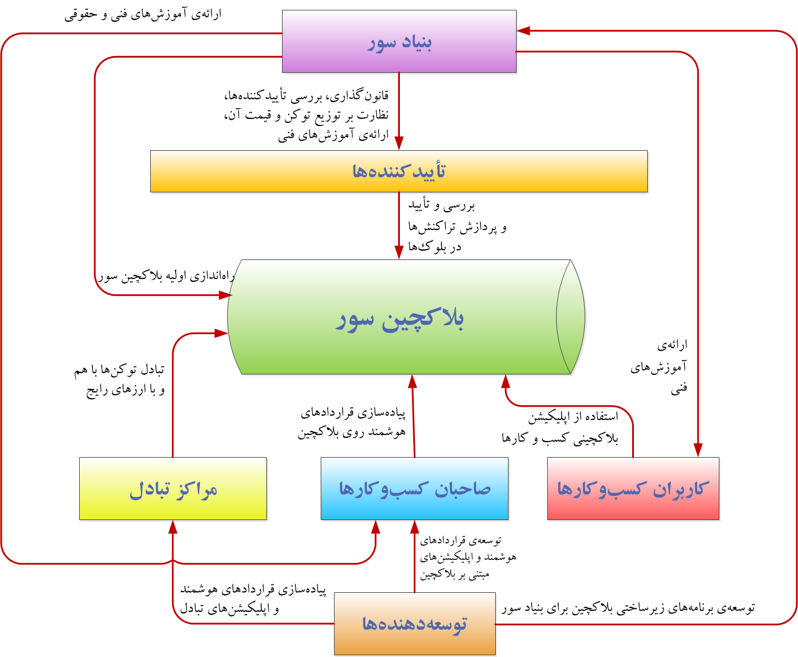

  
# آشنایی با شبکه سور / قسمت دوم

در مقاله پیش، در مورد چیستی شبکه سور و رمزارز سورن صحبت شد. در مورد نیاز به توسعه نسخه بومی بلاکچین با قابلیت پشتیبانی از قراردادهای هوشمند در مدلی مقرون به صرفه توضیحات تکمیلی ارائه شد. در مقاله دوم از سری مقالات آشنایی با شبکه سور، به بررسی بازیگران فعال در شبکه سور خواهیم پرداخت.

## ذی‌نفعان شبکه سور

در شبکه سور نقش‌ها و بازیگران گوناگونی وجود دارد که هر یک وظیفه مشخص خود را دارند. این بازیگران شامل بنیاد سور، تائیدکنندگان، صاحبان کسب‌وکار، کاربران کسب‌وکارها، مراکز تبادل و توسعه‌دهندگان هستند. در ادامه به تشریح نقش هریک از این بازیگران پرداخته شده است.

### بنیاد سور

شبکه سور به‌عنوان یک پلتفرم متن‌باز و قابل توسعه توسط سایر توسعه‌دهندگان، نیازمند نهادی است که نسخه اولیه آن را توسعه دهد و این نسخه اولیه را راه‌اندازی کند. این مسئولیت در شبکه سور به عهده بنیاد سور است. «بنیاد نوآوری و توسعه فناوری زنجیرة بلوک سور» یا به اختصار «بنیاد سور» مؤسسه‌ای است که مجوز فعالیت خود را از معاونت علمی و فناوری ریاست جمهوری دریافت کرده است و از افراد حقیقی و حقوقی مؤسس اولیه شبکه بلاکچین سور تشکیل شده است.

عضویت اعضای جدید در بنیاد سور در صورت تصویب حداقل دوسوم اعضای بنیاد و طی مراحل اداری لازم امکان‌پذیر است.

در ادامه برخی از مهم‌ترین وظایف و اختیارات بنیاد سور فهرست شده است:

- طراحی و توسعه کد متن باز بلاکچین سور و به‌روزرسانی آن
- راه‌اندازی اولیه‌ی بلاکچین سور

تبصره: بنیاد سور هیچ گونه مسئولیتی در رابطه با کسب‌وکارهای فعال بر بستر سور ندارد و هریک از فعالان بایستی بر اساس شرایط و قوانین کشور مجوزهای لازم را از مراجع مربوطه دریافت نمایند.

- سازماندهی تأییدکنندگان اولیه و تلاش جهت توسعه شبکه تأییدکنندگان
- جلب مشارکت فعالان صنعت بلاکچین و رایزنی برای توسعه و به‌روزرسانی بلاکچین سور
- برگزاری گردهمایی سالانه فعالان و توسعه‌دهندگان بلاکچین سور
- تدوین متن توافقنامه بین بنیاد و کاربران شبکه بلاکچین سور موسوم به سپیدنامه
- توزیع توکن‌های پایه شبکه (سورن) که در بلاک پیدایش شبکه تولید شده‌اند، بر مبنای سپیدنامه
- فعالیت‌های آموزشی و ترویجی در جهت توسعه کاربری بلاکچین سور

### تأییدکنندگان تراکنش‌ها

در عموم شبکه‌های بلاکچینی، فرایند بررسی، صحت‌سنجی و ثبت تراکنش‌ها به صورت توزیع‌شده انجام می‌گیرد و یک نهاد مرکزی این مسئولیت را بر عهده ندارد. در شبکه‌های بلاکچینی به اعضایی که این مسئولیت را بر عهده دارند، ولیدیتور، ماینر و مانند آن اطلاق می‌کنند. این اعضا در شبکه سور، تأییدکننده نام دارند. تأییدکننده همان طور که گفته شد به نودهایی گفته می‌شود که صحت تراکنش‌های شبکه را بررسی می‌کنند و تراکنش‌ها را در بلوک ثبت می‌کنند.

وظایف هر تأییدکننده را می‌توان به ترتیب زیر فهرست کرد:

- بررسی صحت تراکنش‌های ارسال شده به شبکه
- ثبت تراکنش‌های صحیح ارسال شده در بلوک
- ثبت و نهایی‌سازی بلوک تشکیل‌شده

### صاحبان کسب‌وکارها

همانطور که پیش‌تر گفته شده، یکی از اهداف اصلی از توسعه زیرساخت سور، ایجاد بستر بلاکچینی مقرون به صرفه برای کسب‌وکارها و کاربران ایرانی است. از همین روی، صاحبان کسب‌وکارها یکی از بازیگران اصلی و تاثیرگذار در سور هستند. صاحبان کسب‌وکارها شامل طیف وسیعی از شرکت‌ها و بنگاه‌های اقتصادی و غیر اقتصادی بزرگ و کوچک و استارتاپ‌ها و شرکت‌های دانش‌بنیان و نیز کارآفرینان فردی هستند که برای ارائه خدمات خود به استفاده از بلاکچین سور نیاز دارند. آنان می‌توانند طرح استفاده از بلاکچین خود را برای دریافت مشاوره‌های حقوقی و فنی با بنیاد سور مطرح کنند و یا خود به طور مستقیم طرح خود را روی شبکه سور اجرایی کنند.

### کاربران کسب‌وکارها

در شبکه سور، کاربران کسب‌وکارها، افراد حقیقی و حقوقی هستند که از کسب‌وکارها برای رفع نیازهای خود استفاده می‌کنند و به واسطه این استفاده، نسبت به ارسال و دریافت تراکنش در شبکه اقدام می‌کنند. کاربران کسب‌‌وکارها یکی از ارکان مهم شبکه هستند. آنان از کاربردهایی که کسب‌وکارهای مختلف روی شبکه ایجاد می‌کنند، استفاده می‌کنند.

### مراکز تبادل (صرافی‌های رمزارزی)

در اکوسیستم سور، منظور از مراکز تبادل، صرافی‌های رمزارزی هستند که رمزارز سورن را در خود فهرست کردند. این مراکز در واقع واسطی برای تبدیل ریال به سورن و بالعکس است. از سویی دیگر، این مراکز همچنین می‌توانند در صورت تمایل خود، نسبت به فهرست کردن سایر توکن‌های مربوط به کسب‌وکارهای فعال در شبکه سور نیز اقدام کنند و امکان تبدیل این توکن‌ها به سورن یا ریال یا سایر رمزارزها را فراهم آورند.

### توسعه‌دهندگان شبکه سور

توسعه‌دهنده‌ها برنامه‌های زیرساختی و کاربردی شبکه نظیر کاوشگر، کیف توکن، نودهای شبکه، قراردادهای هوشمند و اپلیکیشن‌های لازم برای کسب‌وکارها، سازمان‌های دولتی و بنیاد سور را تولید می‌کنند و در ازای آن توکن سورن یا ریال دریافت می‌کنند. بنیاد سور برای امور توسعه، پس از فراخوان و دریافت پیشنهادها طی یک فرآیند رقابتی و شفاف که آیین‌نامه آن متعاقباً اعلام خواهد شد مناسب‌ترین توسعه‌دهنده را انتخاب خواهد کرد.

در ادامه به صورت شماتیک، بازیگران شبکه سور و روابط بین آن‌ها ترسیم شده‌است:

