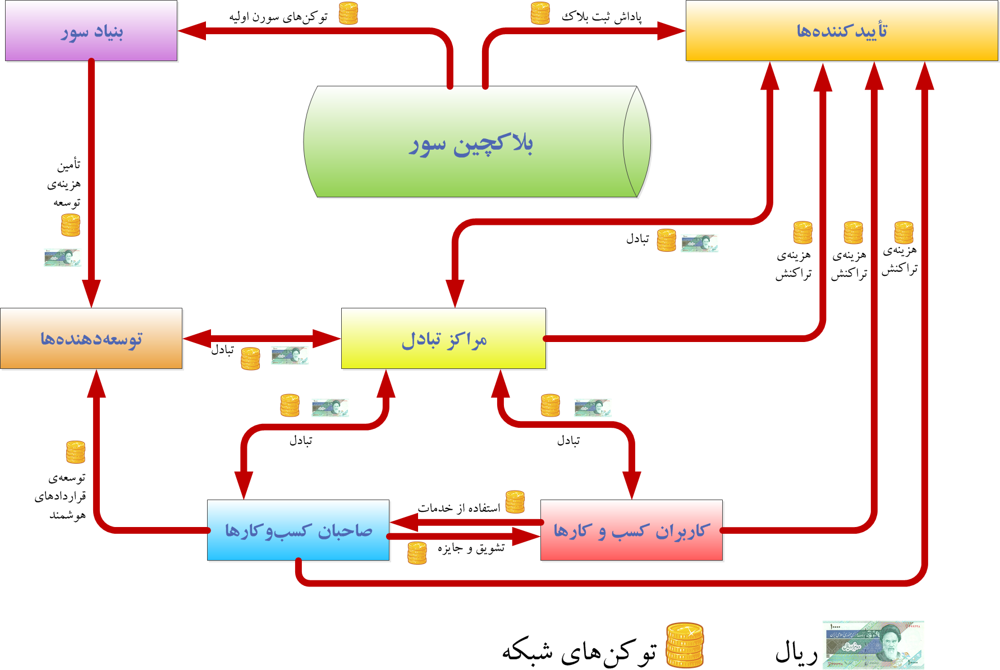

  
# آشنایی با شبکه سور / قسمت سوم

در مقاله قبل با بازیگران پلتفرم سور و وظایف و اختیارات هر بازیگر آشنا شدیم. ذی‌نفعان سور به شرح بنیاد سور، صاحبان کسب‌وکارها، توسعه‌دهندگان، کاربران کسب‌وکارها، تائیدکننده‌ها و مراکز تبادل منطبق بر سپیدنامه شبکه سور به اختصار معرفی شدند که شرح همه این موارد را می‌توانید در سپیدنامه سور به دقت بررسی کنید.

در این مقاله، به بررسی اقتصاد بلاکچین سور، توکن پایه شبکه سور، روابط مالی بازیگران و عناصر شبکه، کارمزد شبکه و شیوه محاسبه آن خواهیم پرداخت. لازم به ذکر است در مقالات بعدی در مورد شیوه تعیین قیمت توکن پایه شبکه، نحوه تولید و توزیع توکن، درآمدهای بنیاد سور، هزینه‌های بنیاد سور و از این دست موارد صحبت خواهیم کرد.

## اقتصاد بلاکچین سور

با هدف حفظ پایداری شبکه سور، نیاز است همه بازیگران شبکه از انگیزه کافی برای ایفای وظایف خود برخوردار باشند و در صورت تخلف از قواعد شبکه، به اندازه کافی جریمه یا محروم از مزایای شبکه بشود. چیدمان چنین قواعد و شرایطی که منتج به بازی درست همه بازیگران می‌شود را اقتصاد بلاکچین یا اقتصاد توکن می‌نامند.

پلتفرم سور همانند پلی میان همه بازیگران شبکه سور است و از طریق آن بازیگران می‌توانند خدمات خود را در اختیار سایرین قرار دهند یا بر رفتار دیگر بازیگران نظارت داشته باشند. برای تنظیم روابط مالی میان بازیگران سور و به منظور فراهم‌سازی ارائه برخی خدمات مالی در سور، توکنی با نام سورن در این شبکه توسعه داده شده است که توکن پایه و نیتیو این شبکه است.

## سورن توکن پایه شبکه سور

توکن پایه شبکه بلاکچین سور، به افتخار یکی از سرداران ایرانی، سورن نام گذاری شده است. این توکن برای پرداخت کارمزد تراکنش‎‌های شبکه سور مورد استفاده قرار می‎گیرد. این کارمزد توسط ثبت کننده تراکنش، پرداخت و توسط تأییدکننده‌ای که این تراکنش توسط وی بر روی دفترکل توزیع شده سور ثبت می‌شود، دریافت می‌شود. به این ترتیب چرخه گردش توکن شبکه تعریف می‌شود.

## سایر توکن‌های شبکه سور
بر روی شبکه سور می‌توان هر دو نوع توکن مثلی و غیرمثلی (Fungible and NonFungible) را توسعه داد. در شبکه سور توکن‌های مثلی تحت استانداری مشابه ERC-20 و توکن‌های غیرمثلی نیز تحت استاندارد مشابه ERC-721 توسعه داده می‌شوند.

## ارتباط مالی بازیگران سور مبتنی بر توکن سورن

طرف‌های مختلف در شبکه بلاکچین سور، به اقتضای نقش خود در شبکه با دیگر بازیگران شبکه مبادلاتی بر مبنای توکن سورن دارند. خلاصه‌ای از این مبادلات در نمودار زیر دیده می‌شود.

### روابط مالی بنیاد سور

بنیاد سور برای تامین هزینه‌های توسعه نسخه اولیه شبکه سور و ایجاد زیرساخت سخت و نرم‌افزاری لازم برای برپایی شبکه و نیز به منظور ترویج و گسترش شبکه سور، مقادیری توکن سورن در بلوک پیدایش تولید و برای اهداف زیر رزرو کرده است:

- تأمین هزینه‌های لازم برای توسعه و به‌روزرسانی شبکه
- تأمین هزینه‌های جاری بنیاد
- تأمین هزینه‌های ترویج و آموزش شبکه

### روابط مالی تاییدکننده‌ها

تأییدکننده‌ها در بلاکچین سور نقش بررسی و ثبت و نگهداری تراکنش‌ها در بلوک‌های شبکه و در نتیجه پایدارسازی شبکه را بر عهده دارند. تأییدکننده‌ها به منظور ایفای این وظایف بایستی زیرساخت سخت‌افزاری و نرم‌افزاری لازم را با هزینه خود ایجاد نمایند و از دو محل می‌توانند این هزینه‌ها را تأمین کنند:

- **پاداش ثبت بلوک**: هر تأییدکننده بابت ثبت هر بلوک در زمان نوبت ثبت خود، مقداری توکن سورن، بابت ثبت آن بلوک دریافت می‌کند. این مقدار توکن، پاداش ثبت بلوک نامیده می‌شود.
- **کارمزد تراکنش**: هر کاربر در زمان ارسال تراکنش به شبکه، باید مقداری توکن سورن به عنوان کارمزد شبکه بپردازد. کارمزد تمام تراکنش‌های هر بلوک در زمان ثبت بلوک به حساب تأییدکننده‌ای که آن بلوک را ثبت می‌کند، واریز می‌شود.

### روابط مالی صاحبان کسب‌وکارها

صاحبان کسب‌وکارها با طرف‌های زیر در تعامل مالی هستند:

- هزینه‌هایی را که کاربران کسب‌وکارها طبق قواعد کسب‌وکار به حساب آنان واریز می‌کنند، دریافت می‌نمایند.
- جوایز یا پاداش‌ها یا موارد دیگری که طبق قواعد خود باید به کاربران بپردازند، پرداخت می‌نمایند.
- بابت توسعه‌های مربوط به اپلیکیشن‌ها و قراردادهای هوشمند، مبالغی را طبق تعهداتشان به توسعه‌دهنده‌ها پرداخت می‌کنند.
- توکن‌های دریافتی را در مراکز تبادل با سایر توکن‌ها یا پول‌های فیات مبادله می‌کنند.

### روابط مالی کاربران کسب‌وکارها

- کاربران کسب‌وکارها طبق قواعد هر کسب‌وکار، مبالغی را در قالب توکن سورن یا توکن‌های دیگر شبکه به صاحبان کسب‌وکار پرداخت می‌کنند.
- کاربران ممکن است مبالغی را به عنوان پاداش یا جایزه از صاحبان کسب‌وکارها دریافت کنند.
- کاربران می‌توانند برای تهیه توکن‌های لازم به مراکز تبادل مراجعه کنند.

### روابط مالی مراکز تبادل

تمام طرف‌های ذی‌نفع در شبکه بلاکچین سور برای استفاده از توکن‌های سورن یا توکن‌های مثلی و قابل مبادله، با مراجعه به یکی از سایت‌های مرکز تبادل، با پرداخت هزینه، توکن مورد نیاز خود را تهیه می‌کنند.

همچنین در صورتی که توکنی را در اختیار داشته باشند و بخواهند آن را به فروش برسانند، می‌بایست به مراکز تبادل مراجعه کنند.

در ازای این خدمات، سایت مرکز تبادل درصدی از توکن‌های مبادله شده را به عنوان کارمزد از فروشنده و خریدار دریافت می‌کند. این درصد طبق سیاست‌های هر سایت مرکز تبادل تعیین می‌شود.

### روابط مالی توسعه‌دهنده‌ها

توسعه‌دهنده‌ها به ازای خدماتی که برای طرف‌های مختلف شبکه بلاکچین سور انجام می‌دهند، مزد کار خود را دریافت می‌کنند.

