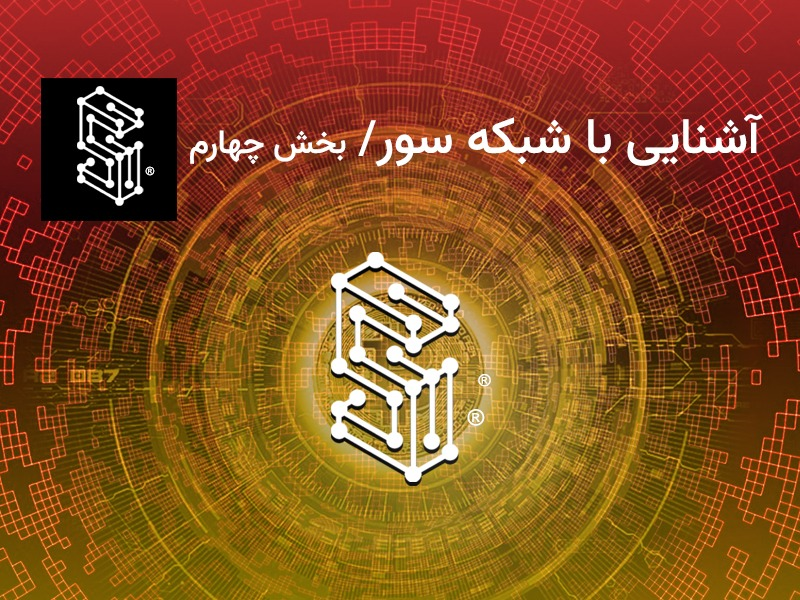

  
# آشنایی با شبکه سور / قسمت چهارم

در مقاله پیشین، در مورد روابط مالی فی‌مابین بازیگران پلتفرم سور نکاتی بیان شد، در این مقاله به عنوان مقاله پایانی از سلسله مقالات بررسی سپیدنامه سور، به چند موضوع محوری خواهیم پرداخت. ابتدا مروری بر مباحث باقیمانده از اقتصاد توکن سورن خواهیم داشت و در نهایت به بررسی نقشه‌راه توسعه‌های آتی سور می‌پردازیم. با ما همراه باشید.

## کارمزد تراکنش‌ها در شبکه سور

برای محاسبه کارمزد تراکنش در شبکه سور بر حسب ریال، نیاز است ابتدا هزینه تراکنش بر حسب گس یا همان سوخت محاسبه شود، سپس قیمت سوخت بر حسب سورن بدست آید تا بتوان در نهایت کارمزد تراکنش بر حسب سورن و ریال تعیین شود.

## هزینه تراکنش بر حسب سوخت

در برخی شبکه‌های بلاکچینی همانند سور، کارمزد تراکنش به میزان منابعی که شبکه برای پردازش آن تراکنش مصرف می‌کند بستگی دارد. با همین منطق در شبکه سور مقدار سوخت لازم برای هر تراکنش بستگی به نوع تراکنش و مقدار پردازش لازم برای انجام تراکنش و نیز ظرفیت ذخیره‌سازی لازم برای آن تراکنش دارد. مثلا تراکنش انتقال سورن از یک حساب به حساب دیگر بدون توجه به مقدار سورن انتقالی، به طور ثابت ۲۱۰۰۰ سوخت است. لازم به ذکر است در بلاکچین سور، سوخت مقدار کمی از توکن سورن است که با استفاده از آن کارمزد تراکنش‌ها پرداخت می‌شود.

## قیمت سوخت بر حسب سورن

قیمت سوخت بر حسب سورن توسط کاربران سور تعیین می‌شود. در واقع ارسال کننده تراکنش، قیمت هر واحد سوخت بر حسب سورن را تعیین می‌کند. اما باید به این نکته توجه داشت که هر تأییدکننده نیز می‌تواند قیمت حداقل هر واحد سوخت جهت پذیرش تراکنش را برای خود تعیین کند. به عبارت دیگر اگر کارمزد تعیین شده توسط کاربر از حداقل کارمزد قابل پذیرش توسط هر تاییدکننده کمتر باشد، آن تراکنش پردازش نخواهد شد.

## هزینه تراکنش بر حسب ریال
کارمزد تراکنش بر حسب ریال، به قیمت سورن به ریال بستگی دارد و از طریق فرمول یر محاسبه می‌شود:

Suren Tx Fee in Rial = Gas amount × Gas Price in SUREN × SUREN Price in Rial

لازم به ذکر است، ارزش توکن سورن بر حسب ریال، در بازار عرضه و تقاضا تعیین خواهد شد.

## مکانیزم‌های موجود برای پایداری قیمت توکن سورن

در شبکه سور، چندین عامل خودکار به همراه برخی عوامل قابل تنظیم که در اختیار تأییدکننده‌ها است، می‌تواند باعث پایداری قیمت سورن می‌شود. این پایداری بدان معناست که با توجه به مکانیزم‌های تعیین شده، امید آن است که قیمت توکن سورن، در شرایط ثبات بازار رمزارزها، دچار نوسانات شدید قیمتی نشود. در این قسمت به بررسی این عوامل می‌پردازیم:

- آزادسازی قیمت توکن سورن، متناسب‌سازی عرضه و تقاضای توکن و تعیین قیمت توکن سورن در بازار عرضه و تقاضا
- هر تأییدکننده یک عامل قابل کنترل جهت تنظیم قیمت سورن در اختیار دارد و آن تعیین «حداقل قیمت سوخت» است. با تنظیم این عامل آن تأییدکننده هیچ تراکنشی با قیمت سوخت کمتر از آن حداقل را ثبت نخواهدکرد. تعیین این عامل طی یک فرایند رقابتی موجب پایین آمدن «حداقل قیمت سوخت» بین تأییدکننده‌ها و در نهایت کم شدن هزینه کارمزد تراکنش‌‌ها برای کاربران نهایی سیستم خواهد شد.

## نحوه تولید توکن سورن

توکن سورن به دو روش تولید می‌شوند. بخشی از منابع توکن در بلوک پیدایش تولید خواهد شد و بخشی دیگر طی فرایند استخراج، ما به ازای ثبت هر بلوک تولید خواهد شد. در بلوک پیدایش بلاکچین سور تعداد ۲۰ میلیون توکن سورن تولید می‌شود. همچنین در زمان ساخت هر بلوک تعدادی توکن نیز تولید می‌شود. تعداد توکن‌های تولید شده در هر بلوک به مرور زمان کاهش می‌یابد تا تعداد توکن‌های تولیدشده در نهایت پس از ۲۰ سال به ۲۰۰ میلیون واحد خواهد رسید. به این ترتیب پس از ۲۰ دوره (یا حدود ۲۰ سال) و تولید ۳۰۰ میلیون بلوک، پاداش ثبت بلوک به صفر خواهد رسید.

## نحوه توزیع توکن سورن

از ۲۰ میلیون توکن تولید شده در بلوک پیدایش، ۱۰ میلیون توکن طی عرضه اولیه خصوصی به فروش خواهد رسید. قیمت پیش‌فروش توکن برابر یک ده‌هزارم توکن اتر در شبکه‌ی اتریوم خواهدبود.

باقیمانده توکن‌های تولیدشده در بلوک پیدایش، برابر با ۱۰ میلیون توکن در یک کیف توکن چند امضایی  که تحت یک قرارداد هوشمند برای بنیاد سور ایجاد می‌شود، ذخیره می‌شود تا برای پوشش هزینه‌های بنیاد مصرف شود. علاوه بر این در هر بلوک پاداش بلوک نیز تولید می‌شود. پاداش بلوک تولید شده به ترتیب زیر توزیع می‌شود:

- ۹۰% از پاداش بلوک تولیدشده به حساب تأییدکننده بلوک واریز می‌شود.
- ۱۰% از پاداش بلوک تولیدشده به حساب بنیاد واریز می‌شود تا برای هزینه‌های لازم بنیاد صرف شود.

## محل مصرف درآمدهای بنیاد سور

هزینه‌های بنیاد سور و درصد آن نسبت به درآمدهای محقق‌شده بنیاد در طی ۱۰ سال اول فعالیت شامل این موارد خواهد بود:

- هزینه توسعه نرم‌افزاری هسته اولیه بلاکچین و سیستم‌های وابسته: ۲۵% از درآمد بنیاد
- هزینه دستمزد اعضای بنیاد: ۱۵% از درآمد بنیاد
- توزیع رایگان توکن سورن به کاربران و اپلیکیشن‌ها و واگذاری به تعدادی از دانشگاه‌های کشور برای توسعه، آموزش، ترویج و تأمین سرور: ۲۰% از درآمد بنیاد
- هزینه تبلیغات و رسانه‌ها : ۱۰% از درآمد بنیاد
- هزینه تولید محتوا، آموزش و ترویج: ۱۵% از درآمد بنیاد
- هزینه برگزاری سمینارهای سالانه: ۵% از درآمد بنیاد
- هزینه‌های پیش‌بینی‌نشده: ۱۰% از درآمد بنیاد

نهاد حسابرسی در بنیاد سور وظیفه‌ی نظارت بر درآمدها و هزینه‌های بنیاد و انطباق آن با مصوبات را بر عهده دارد.

## نقشه‌راه توسعه سور

راه اندازی و تداوم راه پلتفرم بلاکچین سور در این گام‌ها پیش‌بینی شده است:

- نگارش سپیدنامه توکن سورن و شبکه سور
- نگارش اساس‌نامه
- ثبت قانونی بنیاد سور به عنوان مؤسسه غیرتجاری
- توسعه فنی پلتفرم اولیه
- راه‌اندازی وب سایت بنیاد سور
- مشخص شدن نهایی تأییدکننده‌های اولیه (از بنیاد سور و خارج از بنیاد سور)
- پیش راه اندازی و تست
- راه‌اندازی اولیه پلتفرم بلاکچین سور
- ایجاد زیرساخت حقوقی فعالیت
- فراخوان جذب سرمایه گذاران خصوصی
- برگزاری فراخوان پیمانکاران توسعه از طرف بنیاد
- توسعه‌ی سرویس‌های اولیه جهت استفاده از بلاکچین سور
- شروع کمپین‌های آموزشی و تبلیغی با هدف توسعه بازار
- تبلیغ جهت جذب کاربران اولیه
- دستیابی به اهداف فاز اول توسعه بازار
- توسعه تعداد تأییدکننده‌ها
- توسعه شرکای راهبردی نظیر دانشگاه‌ها و مراکز آموزشی و پژوهشی
- اعلان جهت راه‌اندازی محیط‌های جانبی مانند اکسپلورر و تبادل توکن با واحد پول
- اعلان جهت جذب همکاری سازمان‌ها و بانک‌ها‌
- توسعه زیرساخت تعاملات بین شبکه‌ای

## بیانیه رفع مسئولیت

پلتفرم بلاکچین سور صرفاً یک پلتفرم بلاکچینی برای پیاده‌سازی و اجرای قراردادهای هوشمند است و در موارد زیر مسئولیت دارد:

- در حال کار بودن شبکه
- ایجاد ارتباط بین سرورهای شبکه

این پلتفرم در موارد زیر هیچ مسئولیتی ندارد:

- پیاده‌سازی و اجرای قراردادهای هوشمند برای زیان رساندن به دیگران اعم از کاربران شبکه، اشخاص حقیقی و حقوقی دولتی و خصوصی، اعم از کاربر شبکه یا غیر آن.
- پیاده‌سازی و اجرای قراردادهای هوشمند که اصل کار آن یا قسمتی از فعالیت آن مخالف قوانین دولتی یا عرف عمومی باشد.
- ذخیره داده‌های مجرمانه روی قراردادهای هوشمند یا انتشار آن، چه از طرف پیاده‌کنندگان قرارداد هوشمند و چه از جانب کاربران آن.
- عدم صحت اطلاعات در قراردادهای هوشمند شبکه یا به روز نبودن آنها.
- حفظ ارزش توکن پایه‌ی شبکه یا توکن‌های خاصی که در شبکه داد و ستد می‌شود.

«بنیاد نوآوری و توسعه فناوری زنجیره‌بلوک سور» نیز تنها مسئولیت راه‌اندازی اولیه، سازماندهی تأییدکنندگان اولیه‌ی شبکه و نیز توسعه، آموزش، به روز رسانی و ترویج پلتفرم شبکه‌ی بلاکچین سور و نیز وضع مقررات در حوزه‌هایی که اختیار آن را دارا می‌باشد، عهده‌دار است و در حوزه‌های دیگر مسئولیتی ندارد.

هر یک از موارد مطرح شده در این سپیدنامه تا رسیدن به پایداری لازم در شبکه به تشخیص «بنیاد سور» ممکن است تغییر کند.

## کلام آخر

پلتفرم بلاکچین سور با هدف ارائه یک بستر مطمئن، مقرون به صرفه و محرمانه برای پیاده‌سازی اپلیکیشن‌های توزیع‌شده بر بستر قراردادهای هوشمند راه‌اندازی شده است. این شبکه برای رشد و توسعه به کامیونیتی خود وابسته است و در همین راستا دست همکاری خود را به سوی تمامی علاقه‌مندان به توسعه راهکارهای و اپلیکیشن‌های بلاکچینی بر روی شبکه سور دراز می‌کند.

